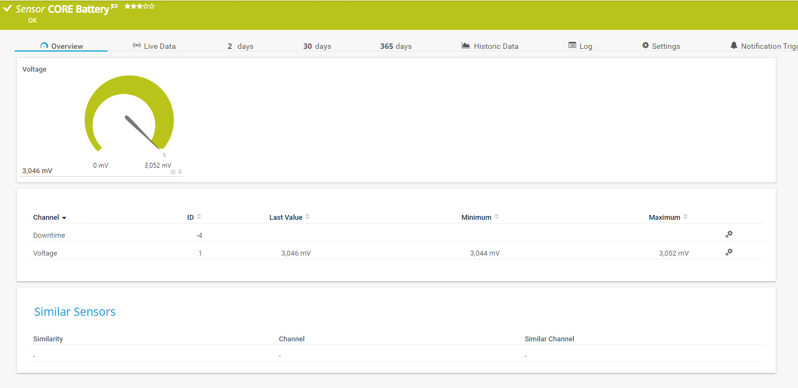
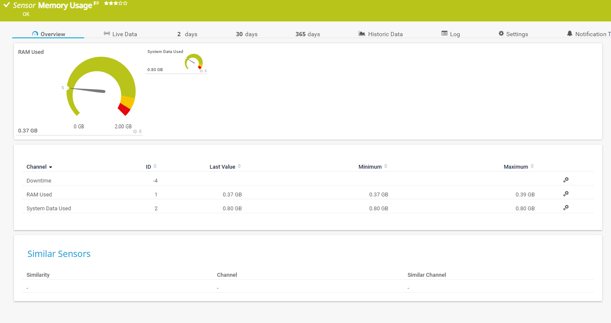

PRTG Device Template for  Bosch Rexroth ctrlX Core X3 devices
===========================================

This project contains all the files necessary to integrate the ctrlx
into PRTG for auto discovery and sensor creation.

Please use this link to download [ctrlX  Template Install package](https://gitlab.com/PRTG/Device-Templates/ctrlX/-/jobs/artifacts/master/download?job=PRTGDistZip)

Installation Instructions
=========================
You can unzip the content of the installation package directly into the PRTG Executable directory.

The template project has a standard directory structure:
[All the files in the PRTG subdirectory needs to go into the PRTG program directory](https://kb.paessler.com/en/topic/463-how-and-where-does-prtg-store-its-data). 

The templates was designed and tested with  the following devices:
* ctrlX CORE X3
* ctrlX Virtual CORE

Sensor descriptions
====

Template: Bosch Rexroth ctrlX (Bosch Rexroth ctrlX.odt)
------
The Critical Data You Can Monitor With PRTG, utilizing custom OPC UA sensors, you can monitor a wide array of vital data points:

------

CORE Battery : Essential to monitor the core bettery voltage

CORE Temprature:Essential for maintaining optimal operational conditions and preventing overheating.

Memory utilization: Critical for ensuring the PLC operates within its capacity, avoiding potential slowdowns or crashes.

Network Interfacelink: Vital for tracking communication efficiency and identifying potential network bottlenecks.

------

